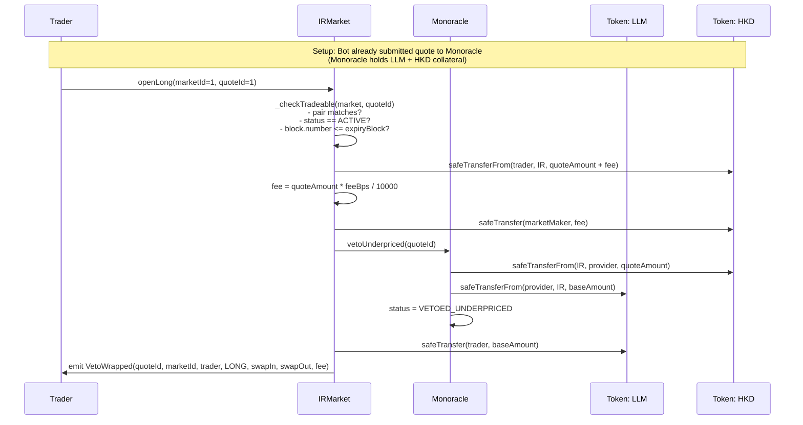
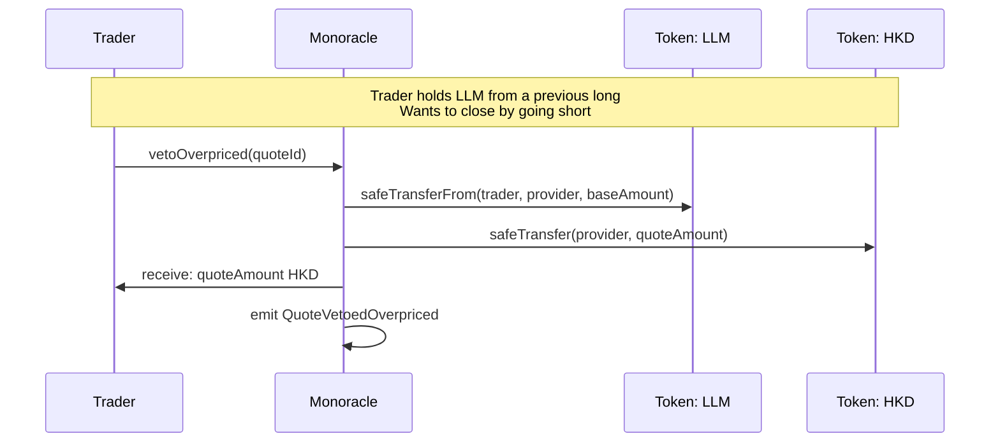
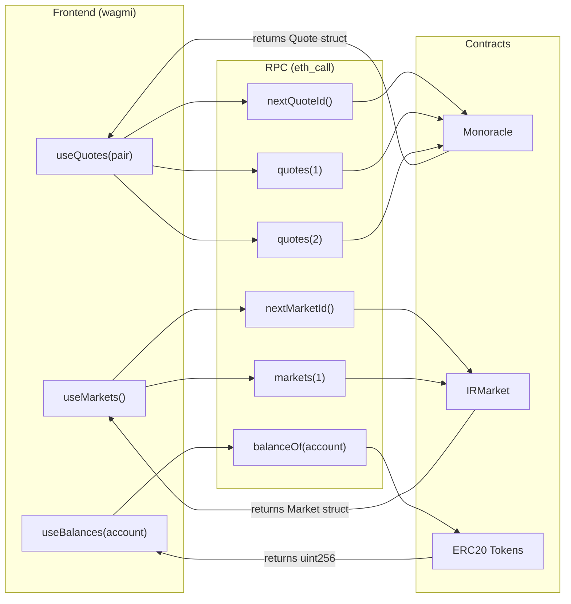

# IRMarket — Architecture Diagram

> How IRMarket contracts interact with upstream Monoracle.

## 1. Architecture Overview

```mermaid
graph TB
    subgraph "Upstream (github.com/dixia/monoracle)"
        M[Monoracle Contract<br/>(immutable, deployed on Monad)]
    end

    subgraph "IRMarket (this repo)"
        IR[IRMarket Wrapper<br/>(thin factory + fee layer)]
        IM[IMonoracle Interface<br/>(type-safe ABI)]
    end

    subgraph "Token Layer"
        LLM[MockERC20: LLM<br/>(base asset)]
        HKD[MockERC20: HKD<br/>(quote asset)]
    end

    subgraph "Actors"
        BOT[Market-Maker Bot<br/>(submits quotes, holds collateral)]
        TRADER[Trader Wallet<br/>(long / short via veto)]
        FE[Next.js Frontend<br/>(wagmi + tanstack query)]
    end

    IR -->|"immutable oracle"| M
    IR -.->|"imports"| IM
    M -.->|"implements"| IM

    BOT -->|"submitQuote(LLM, HKD, baseAmt, quoteAmt, expiryBlock)"| M
    BOT -->|"approve(LLM, HKD)"| M
    M -->|"holds collateral"| LLM
    M -->|"holds collateral"| HKD

    TRADER -->|"createMarket(base, quote, MM, expiry, feeBps)"| IR
    TRADER -->|"openLong(marketId, quoteId)"| IR
    TRADER -->|"openShort(marketId, quoteId)"| IR
    TRADER -->|"direct close: vetoUnderpriced / vetoOverpriced"| M

    IR -->|"vetoUnderpriced(quoteId)"| M
    IR -->|"vetoOverpriced(quoteId)"| M
    M -->|"swap tokens"| LLM
    M -->|"swap tokens"| HKD

    FE -->|"eth_call: nextQuoteId, quotes(quoteId)"| M
    FE -->|"eth_call: markets(marketId)"| IR
    FE -->|"read MarketCreated, VetoWrapped, QuoteSubmitted"| M

    style M fill:#4CAF50,color:#fff
    style IR fill:#2196F3,color:#fff
    style IM fill:#90CAF9,color:#000
    style LLM fill:#FF9800,color:#fff
    style HKD fill:#FF9800,color:#fff
    style BOT fill:#9C27B0,color:#fff
    style TRADER fill:#F44336,color:#fff
    style FE fill:#00BCD4,color:#fff
```

## 2. Call Flow: Open Long (Wrapper Path)



## 3. Call Flow: Direct Close (No Fee)



## 4. Data Flow: Frontend Reads



## 5. Key Design Points

| Aspect | Detail |
|--------|--------|
| **IRMarket role** | Thin factory + 1% fee wrapper. Does NOT price, match, settle, or hold pools. |
| **Monoracle role** | Trading venue + price source. Quotes carry bilateral collateral. Veto = trade. Settlement = canonical price. |
| **Long = vetoUnderpriced** | Trader pays HKD (quote), receives LLM (base). Bot sold LLM too cheap. |
| **Short = vetoOverpriced** | Trader pays LLM (base), receives HKD (quote). Bot sold LLM too expensive. |
| **Fee** | Always in HKD (quote token). Charged on open only. Direct closes = no fee. |
| **No fork** | IRMarket uses upstream Monoracle directly via `IMonoracle` interface. No vendored oracle code. |
